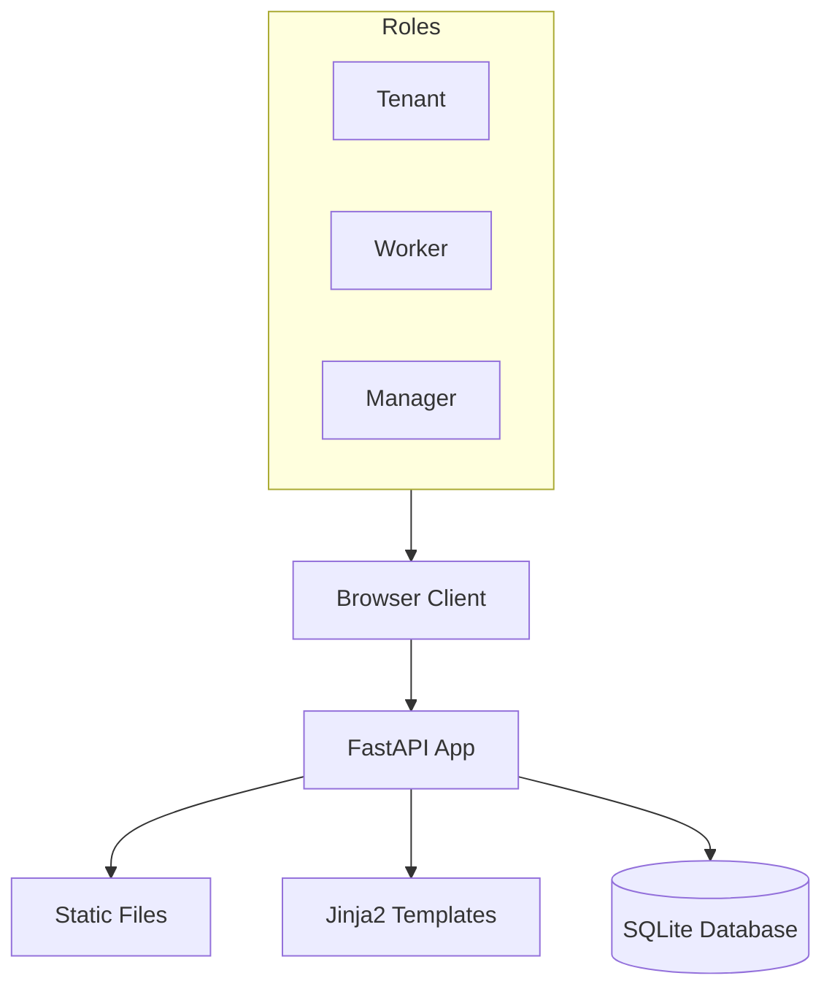

# Building Maintenance Request System

A Python FastAPI application for managing building maintenance requests with role-based access for tenants, workers, and managers.

## Full Prompt
```
Build a Python FastAPI application for a Building Maintenance Request System. Use SQLite for the database and Jinja2 templates for the frontend (no React/Next.js — keep it simple).

Pages:
- Login page — simple username/password with 3 hardcoded users: a tenant, a maintenance worker, and a building manager. Role-based access.
- Submit Request — tenant form with unit number, category (plumbing/electrical/HVAC/general), urgency (low/medium/high/emergency), and description.
- My Requests — tenant view of their submitted requests with status tracking.
- Work Queue — maintenance worker view: assigned requests sorted by urgency, with status update buttons (in-progress/completed).
- Dashboard — manager view: open requests, average resolution time, requests by category, worker performance.

Requirements:
- Seed the database with 12 requests across categories and statuses, 8 units, on first run
- Clean professional styling (white, dark slate, yellow for urgent, red for emergency)
- Navigation sidebar with logged-in user name and role
- Include a /health endpoint that returns {"status": "ok"}
- SQLite database at ./data/maintenance.db
- Include requirements.txt and a Dockerfile
- Main entry point: uvicorn main:app --host 0.0.0.0 --port 8000
Documentation:
- Include a README.md with the following sections:
  1. Project title and one-line description
  2. The full prompt used to generate this application
  3. System architecture diagram in Mermaid format (use simple node labels, avoid special characters or slashes in node names)
  4. Project structure — list of files with brief descriptions
  5. Setup and usage instructions: how to install dependencies, run locally, and run with Docker
  6. Login credentials table for each role
  7. Available endpoints with HTTP method and description

---
## DEPLOYMENT REQUIREMENTS (MANDATORY)

**Dockerfile (REQUIRED - PORT 8000):**
You MUST create a Dockerfile. CRITICAL: App MUST listen on port 8000.
For Python apps with SQLite:
```dockerfile
FROM python:3.11-slim
WORKDIR /app
COPY requirements.txt .
RUN pip install --no-cache-dir -r requirements.txt
COPY . .
RUN mkdir -p data
EXPOSE 8000
CMD ["python", "main.py"]
```
NOTE: The `mkdir -p data` is REQUIRED for SQLite to work in Docker.
NOTE: Your main.py MUST run the server on port 8000, not any other port.

**Next.js:**
- MUST add `output: 'standalone'` to next.config.ts/js for Docker deployment
- Example: `const nextConfig = { output: 'standalone' }`

**FastAPI (CRITICAL - PORT 8000):**
- MUST use port 8000 - the deployment proxy expects this port
- MUST add at the bottom of main.py:
  ```python
  if __name__ == "__main__":
      import uvicorn
      uvicorn.run(app, host="0.0.0.0", port=8000)
  ```
- Do NOT use any other port (not 8080, not 8081, not 3000) - ONLY port 8000

**Static Files (CRITICAL - READ CAREFULLY):**
- Do NOT use StaticFiles() unless you have actual CSS/JS files to serve
- If you use `app.mount("/static", StaticFiles(directory="static"))`, you MUST ALSO:
  1. Create the `static/` directory with at least one file (e.g., `static/.gitkeep`)
  2. Add `RUN mkdir -p static` to Dockerfile BEFORE the CMD line
- App will CRASH on startup if static directory doesn't exist
- For simple apps: use inline styles in templates, do NOT import or mount StaticFiles

**Python Dependencies (requirements.txt):**
```
# requirements.txt MUST include all dependencies:
fastapi
uvicorn[standard]
itsdangerous  # Required for session middleware
jinja2
sqlalchemy
python-multipart
```

**Password Hashing (IMPORTANT):**
DO NOT use `passlib` - it has compatibility issues with modern bcrypt versions.
Use `bcrypt` directly instead:
```python
import bcrypt

# Hash password
hashed = bcrypt.hashpw(password.encode('utf-8'), bcrypt.gensalt())

# Verify password
bcrypt.checkpw(password.encode('utf-8'), hashed)
```
Add `bcrypt` (not `passlib[bcrypt]`) to requirements.txt.


---
## DOCUMENTATION (MANDATORY)

**README.md is REQUIRED.** If the prompt specifies README requirements, you MUST follow them EXACTLY.
If no specific format is given, include at minimum:
- Project title and description
- Setup instructions (install dependencies, run locally, run with Docker)
- Login credentials for each role (if authentication exists)
- API endpoints list (if applicable)

**IMPORTANT:** Do not skip or abbreviate documentation requirements from the original prompt.
```

## System Architecture



## Project Structure

- `main.py`: Application entry point, routes, and startup logic.
- `database.py`: Database connection and SQLAlchemy models.
- `requirements.txt`: Python dependencies.
- `Dockerfile`: Docker configuration for deployment.
- `templates/`: HTML templates for the frontend.
  - `base.html`: Base layout with sidebar.
  - `login.html`: Login page.
  - `submit_request.html`: Tenant form for new requests.
  - `my_requests.html`: List of tenant's submitted requests.
  - `work_queue.html`: Worker's list of assigned tasks.
  - `dashboard.html`: Manager's overview of system status.
- `static/`: Static assets (CSS).
  - `styles.css`: Custom styling for the application.
- `data/`: Directory for SQLite database (created on runtime).

## Setup and Usage

### Install Dependencies
```bash
pip install -r requirements.txt
```

### Run Locally
```bash
python main.py
```
The application will be available at `http://localhost:8000`.

### Run with Docker
1. Build the image:
```bash
docker build -t maintenance-app .
```
2. Run the container:
```bash
docker run -p 8000:8000 maintenance-app
```

## Login Credentials

| Role    | Username | Password |
|---------|----------|----------|
| Tenant  | tenant   | password |
| Worker  | worker   | password |
| Manager | manager  | password |

## Available Endpoints

| Method | Endpoint | Description |
|--------|----------|-------------|
| GET | `/` | Redirects to role-specific home page or login |
| GET | `/health` | Health check returning `{"status": "ok"}` |
| GET | `/login` | Login page |
| POST | `/login` | Authenticate user |
| GET | `/logout` | Clear session and redirect to login |
| GET | `/tenant/submit` | Form to submit a new request |
| POST | `/tenant/submit` | Process new request submission |
| GET | `/tenant/requests` | View submitted requests |
| GET | `/worker/queue` | View assigned work queue |
| POST | `/worker/update/{id}` | Update request status |
| GET | `/manager/dashboard` | View system dashboard |
